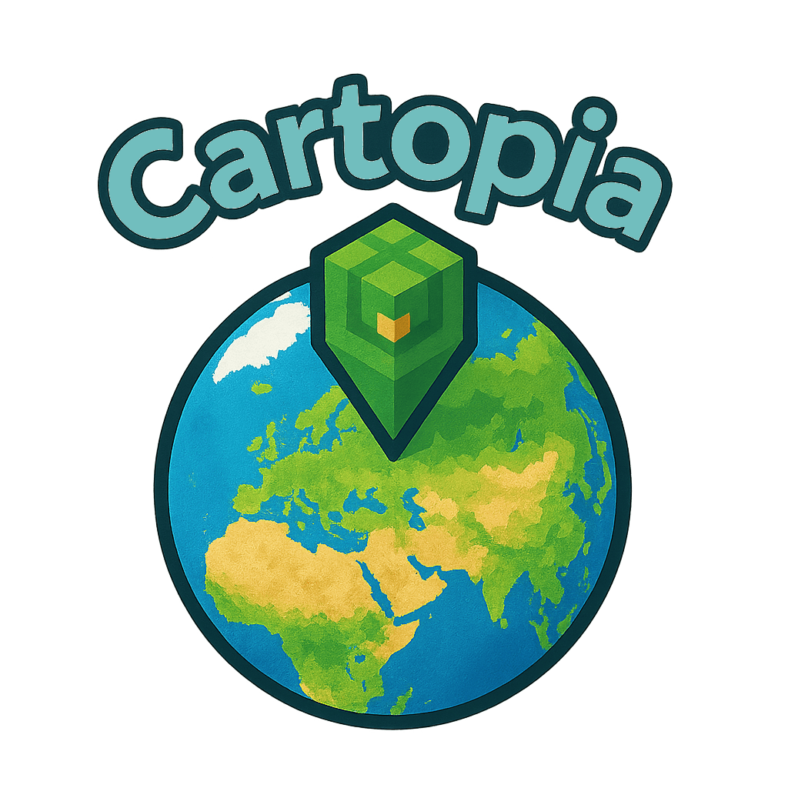

    
  
  

 

# Cartopia - the real world in Minecraft 1.20.1 (Forge) at a 1:1 scale

**Cartopia** - a mod for Minecraft 1.20.1 (Forge) that allows you to generate any section of the Earth's surface right in the game, at a 1:1 scale, taking into account real terrain, current time, weather conditions, and all buildings and infrastructure*.  
Cities and natural areas are recreated as fully as possible: buildings of the required shapes (including composite parts and complex footprints), the road-rail network with a correct longitudinal profile and elevation marks relative to the terrain; engineering and urban infrastructure in accordance with the topology of objects; vegetation is modeled with regard to planting types, and the landform follows the real relief. In-game time and weather conditions are synchronized with the real ones in the selected area. Everything is generated from open data sources.

Go on virtual expeditions and create cinematic shots and scenes - **Cartopia** is made for curiosity and exploration.

 

## Key features*  
- **1:1 scale** - real distances and outlines of the terrain are transferred into the game world.
- **Relief** - digital elevation models are used to shape the natural landscape.
- **Cities and infrastructure** - roads, blocks, buildings, vegetation, and objects down to the smallest details.
- **Time and weather** - synchronization with real conditions in the selected area.
- **Convenient web interface** - selecting an area on the map, searching by place names, clear generation parameters.
- **Flexibility** - the exact area that interests you is generated.

 
  

---

 
 

## Generation examples

<table>
  <thead>
    <tr>
      <th>Generated (Cartopia)</th>
      <th>Panorama of the area</th>
    </tr>
  </thead>
  <tbody>
    <!-- Block 1 -->
    <tr>
      <th colspan="2" align="center">View from the esplanade of the “Kuala Lumpur City Centre” complex toward the Petronas Towers - Kuala Lumpur, Malaysia.</th>
    </tr>
    <tr>
      <td align="center">
        
      </td>
      <td align="center">
        
      </td>
    </tr>
    <!-- Block 2 -->
    <tr>
      <th colspan="2" align="center">View from the waterfront by Burj Khalifa Lake - Dubai, UAE.</th>
    </tr>
    <tr>
      <td align="center">
        
      </td>
      <td align="center">
        
      </td>
    </tr>
    <!-- Block 3 -->
    <tr>
      <th colspan="2" align="center">Top-down view of the Burj Khalifa and Burj Lake with the “Singing Fountains of Dubai” complex - Dubai, UAE.</th>
    </tr>
    <tr>
      <td align="center">
        
      </td>
      <td align="center">
        
      </td>
    </tr>
    <!-- Block 4 -->
    <tr>
      <th colspan="2" align="center">View from the “Top of the Rock” observation deck (Rockefeller Center) toward the Empire State Building and Lower Manhattan - New York, USA.</th>
    </tr>
    <tr>
      <td align="center">
        
      </td>
      <td align="center">
        
      </td>
    </tr>
    <!-- Block 5 -->
    <tr>
      <th colspan="2" align="center">View from the Gulf of Finland toward the “Lakhta Center” - Saint Petersburg, Russia.</th>
    </tr>
    <tr>
      <td align="center">
        
      </td>
      <td align="center">
        
      </td>
    </tr>
    <!-- Block 6 -->
    <tr>
      <th colspan="2" align="center">Moscow-City - view from below at the “Mercury” tower (Presnenskaya Embankment), Moscow, Russia.</th>
    </tr>
    <tr>
      <td align="center">
        
      </td>
      <td align="center">
        
      </td>
    </tr>
    <!-- Block 7 -->
    <tr>
      <th colspan="2" align="center">Top-down view of St. Isaac’s Cathedral and St. Isaac’s Square - Saint Petersburg, Russia.</th>
    </tr>
    <tr>
      <td align="center">
        
      </td>
      <td align="center">
        
      </td>
    </tr>
    <!-- Block 8 -->
    <tr>
      <th colspan="2" align="center">The Field of Mars and the Summer Garden, view toward Trinity Bridge and the Peter and Paul Fortress - Saint Petersburg, Russia.</th>
    </tr>
    <tr>
      <td align="center">
        
      </td>
      <td align="center">
        
      </td>
    </tr>
    <!-- Block 9 -->
    <tr>
      <th colspan="2" align="center">Alley of the Summer Garden, view toward the Coffee House - Saint Petersburg, Russia.</th>
    </tr>
    <tr>
      <td align="center">
        
      </td>
      <td align="center">
        
      </td>
    </tr>
    <!-- Block 10 -->
    <tr>
      <th colspan="2" align="center">Peter and Paul Fortress on Zayachy Island - Saint Petersburg, Russia.</th>
    </tr>
    <tr>
      <td align="center">
        
      </td>
      <td align="center">
        
      </td>
    </tr>
    <!-- Block 11 -->
    <tr>
      <th colspan="2" align="center">The Winter Palace and Palace Square with the Alexander Column - Saint Petersburg, Russia.</th>
    </tr>
    <tr>
      <td align="center">
        
      </td>
      <td align="center">
        
      </td>
    </tr>
    <!-- Block 12 -->
    <tr>
      <th colspan="2" align="center">The Tower of London and Tower Bridge - London, United Kingdom.</th>
    </tr>
    <tr>
      <td align="center">
        
      </td>
      <td align="center">
        
      </td>
    </tr>
    <!-- Block 13 -->
    <tr>
      <th colspan="2" align="center">Lombard Street (the crooked section on Russian Hill) - San Francisco, USA.</th>
    </tr>
    <tr>
      <td align="center">
        
      </td>
      <td align="center">
        
      </td>
    </tr>
    <!-- Block 14 -->
    <tr>
      <th colspan="2" align="center">Cable cars on California Street, view toward Nob Hill - San Francisco, USA.</th>
    </tr>
    <tr>
      <td align="center">
        
      </td>
      <td align="center">
        
      </td>
    </tr>
    <!-- Block 15 -->
    <tr>
      <th colspan="2" align="center">Multi-level interchange of the MKAD and Yaroslavskoye Highway - Moscow, Russia.</th>
    </tr>
    <tr>
      <td align="center">
        
      </td>
      <td align="center">
        
      </td>
    </tr>
    <!-- Block 16 -->
    <tr>
      <th colspan="2" align="center">Multi-level interchange of flyovers in the Puxi area - Shanghai, China.</th>
    </tr>
    <tr>
      <td align="center">
        
      </td>
      <td align="center">
        
      </td>
    </tr>
    <!-- Block 17 -->
    <tr>
      <th colspan="2" align="center">Intersection of Engels Prospekt and Lunacharsky Prospekt - Saint Petersburg, Russia.</th>
    </tr>
    <tr>
      <td align="center">
        
      </td>
      <td align="center">
        
      </td>
    </tr>
    <!-- Block 18 -->
    <tr>
      <th colspan="2" align="center">View of the Chertanovo Severnoye blocks from Kirovogradskaya Street, toward Bitsevsky Forest Park - Moscow, Russia.</th>
    </tr>
    <tr>
      <td align="center">
        
      </td>
      <td align="center">
        
      </td>
    </tr>

  </tbody>
</table>

 
  

---

 
 

## Installation and launch

1. Download the latest Cartopia release from the [Releases](https://github.com/TheAndreyZakharov/Cartopia/releases) section.
2. Install Minecraft 1.20.1 and Forge 47.4.0 (the branch for 1.20.1).
3. Place the mod file `cartopia_x.x.x_mc1.20.1_forge47.jar` into the `mods/` folder of your Minecraft profile.
4. Launch the game and create a **new world** with the following parameters:
   - **Game Mode:** Creative  
   - **Difficulty:** Peaceful  
   - **Allow Cheats:** ON  
   - **World Type:** Superflat  
   - **Generate Structures:** OFF
5. Enter the world and **follow the mod’s prompts** to select an area and start generation.
> **Recommendation:** start by generating a small area (for example, a square up to 300–500 m per side) and make sure everything works roughly as expected. After verification, move on to larger regions — excessively large areas right away may take a long time to process and/or lead to rejections from external services.
> **Note:** the result may vary slightly between runs even with the same parameters (random materials, terrain/water smoothing).

 

## Recommended additions (mods and datapacks)

Below are additions that usually help reveal Cartopia’s full potential. **Match versions strictly to Minecraft 1.20.1 (Forge).**

- **HigherHightsUltimate** (world height increase datapack).  
  Needed so that skyscrapers and tall objects are generated in full.  
  _Installation:_ create a world → exit it (or the game entirely) → place the datapack `.zip` into `saves/<world_name>/datapacks/` → launch the world again → then start generation.

- **DistantHorizons** (LOD distant rendering).  
  Allows you to see vast areas without a critical FPS drop.  
  _Installation:_ place the `.jar` into the `mods/` folder alongside Cartopia.  
  _Note:_ compatibility with some shaders is limited — check specific combinations.

- **Shaders** (to taste and for the task).  
  Improve cinematic quality and scene readability.  
  _Installation:_ put the shader archive into `shaderpacks/`. Often requires **OptiFine** (or a compatible equivalent for Forge).  
  _Note:_ not all shaders play nicely with **DistantHorizons** — consult the documentation of the chosen shader/mod.

> **Important:** large generation areas + heavy shaders + distant rendering may require a powerful PC and fine-tuned graphics settings.

**Parameters and tools of the “Generation examples”:**

- **Shaders:** *Complementary Shaders* with additional effects disabled (fog, bloom/glare, etc.). The pack is available in variants for x86-64 (Windows/Linux) and ARM64 (e.g., Apple Silicon).
- **Distant rendering:** without *DistantHorizons*; standard render distance - 64 chunks.
- **Height datapack:** in some scenes, *HigherHightsUltimate* was used for the correct height of tall objects.
- **Field of view (FOV):** to more accurately match the reference photo, FOV was selected individually for each screenshot (from a “narrow” telephoto perspective to a wide angle). This affects perspective compression and composition.
- **Note:** the final image may differ slightly due to your shader settings, graphics, and display calibration.

 
  

---

 
 

## Important warning about usage

Cartopia is intended for **education, research, virtual travel, and creative projects**.

**User rules and standards:**
- **Respect and correctness.** Desecration, distortion, and deliberate “smearing” of real cities, monuments, religious and cultural sites, cemeteries, memorials, etc. are unacceptable.
- **Ethics and religion.** Observe moral, ethical, and religious norms. Do not allow actions that may be perceived as disrespect to faith, culture, or traditions.
- **Zero tolerance for abuse.** Any forms of hate, discrimination, promotion of violence, bullying, and incitement of enmity in created worlds are prohibited.
- **Sensitive locations.** Treat places of tragedies, conflict zones, and natural disasters with caution - avoid trivialization and “playful” use of such spaces.
- **Privacy and safety.** Do not use the generated data for surveillance, invasion of privacy, or planning illegal activity. Principle - “do no harm”.

**Licenses and attribution:**
- Observe the licenses of sources, assets, tools, and the rules of the platforms where content is published.  

**Responsibility and the author’s position:**
- The mod is a tool. The author does not encourage and is not responsible for unethical or illegal use of generation results.
- Maps, boundaries, toponyms, and any geopolitical designations in the mod do not express the author’s political views and are not a statement of position; they reflect open data, predominantly community-sourced (e.g., OSM), and are used solely as a technical basis without value judgments or endorsement of any side.
- If a significant inaccuracy is introduced during generation due to the algorithms (and not the source data), deep apologies are offered in advance: it is extremely difficult to account for all real-world cases; such situations are not intentional.

**Feedback:**
- If you find errors, inaccuracies, or contentious cases, it is more appropriate to report the problem (issue/bug report) and help improve the mod, rather than try to “fix” the situation by unethical means.

 
  

---

 
 

## Cartopia interfaces and controls

**Mod window in the Mods list.**  

  

This is how Cartopia’s card looks in the standard menu of all installed mods: the name, version, ModID, license, credits, and links to the repository are shown. The appearance of this entry means the mod is loaded and active.

**System messages on world entry.**  

  

With Cartopia active, immediately after the world loads, the chat displays messages about the mod being ready and a hint for the menu hotkey. This confirms the mod initialized correctly.

**Cartopia in-game menu (key `M`).**  

  

On the left is a brief usage guide: step-by-step tips and warnings. On the right is the Open Map button to launch the web map and the Real-world time/weather switch (turns synchronization of time and weather with real conditions on/off).  
Next per the guide: click Open Map.

**Link opening confirmation window.**  

  

After clicking the link in the game, a system dialog appears with the address `http://127.0.0.1:4567`. Options available:
- Open in Browser — open the link in the browser (recommended);
- Copy to Clipboard — copy the address to the clipboard;
- Cancel — cancel.

To proceed to the web map, click Open in Browser.

**Web map: start screen.**  

  

After clicking “Open in Browser,” the page `http://127.0.0.1:4567` opens with a world map and a floating control panel on the right.

**Control panel: general view.**  

  

On the right side of the page there is a floating panel—through it you can conveniently manage all core functions (theme, search, area selection, zoom, window size, confirmation).  
In the following section, each button and input field is explained step by step.

**Search for a place.**

  

Enter a city name, address, or coordinates in the Search for a city, address, or coordinates field and click Find (or press Enter) — the map will move to the found point.

**Dark theme.**

  

The panel supports a dark theme: it automatically follows system settings and, if needed, can be switched manually with the Enable light/dark theme button at the top of the panel.

**Selecting an area on the map.**

  
  

First click Select area (as in the left screenshot). Then a dashed square will appear on the map — these are the boundaries of the area you will generate. The small filled square in the center is the approximate player spawn point and the “anchor” for time and weather synchronization within the selected zone.  
After activation, the Select area button will change to Cancel selection — click it to cancel the selection and remove the square from the map.

**Map scale.**

  

The Zoom in and Zoom out buttons change the map scale just like scrolling with the mouse wheel/trackpad gesture: they zoom in and out around the current screen center.

**Area size.**

  

The Side length (meters) field sets the side of the dashed square on the map — that is, the boundaries of the generation area.  
By default — 500 m, minimum — 200 m. The value can be entered manually or changed with the – / + buttons (step 100 m). Below the field, an estimate of the area is displayed, and the dashed square on the map automatically changes size.

**Confirming the selection.**

  

Click Confirm to lock in the current area.  
After this, preparation and downloading of the necessary data (map/terrain/service files) will begin and the parameters will be sent to the game. Wait for the success message and do not close the page until the step is complete.

**Save notification.**

  

After clicking Confirm, if export succeeds, a “Saved!” window will appear.  
This means the selected area has been saved, the required data has been downloaded and transferred to the game — the generation process begins. Click OK (or press Enter) and return to Minecraft; do not leave the world until generation is complete.

**Generation progress messages.**

  

During generation, service messages about the current stage are displayed in chat — this helps you understand what is happening right now. The sign of successful completion is that the following lines appear in succession:  
`[Cartopia] Saving world...` → `Generation finished.` → `Generation finished. Package: area_...`  
When these messages appear, generation is complete and the data are saved; give the area a little time to load in (the character may “adjust” in height with a slight delay), after which you can continue playing.

**Hiding the control panel.**

  <table>
    <tr>
      <td align="center" valign="top">
        
      </td>
      <td align="center" valign="top">
        
      </td>
    </tr>
  </table>

Sometimes, for easier map exploration, the panel can be temporarily hidden — click the round arrow in the top-left corner of the panel. Click it again to bring the panel back.

**Moving the control panel.**

  <table>
    <tr>
      <td align="center" valign="top">
        
      </td>
      <td align="center" valign="top">
        
      </td>
    </tr>
  </table>

You can drag the panel to a convenient place: hold the cross icon in the top-right corner of the panel with the mouse and drag it.  
If you want to quickly return the panel to its default position — hide it with the arrow and show it again: upon expanding, the position resets to the default.

 
  

---

 
 

## How Cartopia works

1. When the world launches, a local web server (on `localhost`) is started, providing a browser interface for selecting the region, scale, and generation parameters.  
2. In the interface, an area is highlighted on the map (toponym search is supported). A parameter package is formed: coordinates, window size, system options.  
3. A DEM (digital elevation model) is downloaded for the selected bounds; if tools are available, a landcover raster layer is clipped to the rectangle.  
4. OpenStreetMap data are requested via Overpass/Nominatim: roads, buildings, rails, water features, POIs, etc.  
5. The data are converted to service formats (“sidecars”), then the Cartopia Pipeline is started (see the next section).  
6. After rendering the surface, players are moved to a safe elevation within the generated area.  
7. The time and weather controller periodically updates conditions.
8. The world is saved; a service cleanup of dropped items is performed.

 

## Generation stages (Cartopia Pipeline - full list)

- **Preparation:**
  - Loading coordinates/parameters.
  - Preparing “sidecars” (NDJSON with features, relief grid).
- **Relief and start:**
  - `SurfaceGenerator` - generation of the surface (DEM + coloring by landcover).  
  - `CartopiaSurfaceSpawn.adjustAllPlayersAsync` - raise players to a safe surface.
- **Roads and transport lines:**
  - `RoadGenerator` - roads.
  - `RailGenerator` - railways.
  - `PierGenerator` - piers.
- **Road markings and areas:**
  - `CrosswalkGenerator` - pedestrian crossings.
  - `StopMarkingGenerator` - markings at stops.
  - `RailStopLineGenerator` - stop lines at railway crossings.
  - `HelipadGenerator` - helipads.
  - `ParkingStallGenerator` - parking stall markings.
- **Bridges and tunnels:**
  - `BridgeGenerator` - bridges/multi-level overpasses.
  - `TunnelGenerator` - tunnels/underpasses.
  - `RoadButtonMarkingGenerator` - road markings.
- **Buildings:**
  - `BuildingGenerator` - generation of buildings (including composite parts).
- **Lighting:**
  - `RoadLampGenerator` - street lights along roads.
  - `RailLampGenerator` - lights along rails.
- **Infrastructure and objects:**
  - `UtilityBoxGenerator` - street utility boxes.
  - `LighthouseGenerator` - lighthouses.
  - `WindTurbineGenerator` - wind turbines.
  - `ClassicWindmillGenerator` - classic windmills.
  - `WatchtowerGenerator` - watchtowers.
  - `ChimneyGenerator` - chimneys/vents.
  - `TowerMastGenerator` - towers/masts.
  - `UtilityTankTowerGenerator` - tank towers.
  - `SolarPanelGenerator` - solar panels/fields.
  - `SubstationGenerator` - electrical substations.
  - `PowerLinesGenerator` - power transmission lines (poles/towers/wires).
  - `FuelPumpGenerator` - fuel dispensers at gas stations.
  - `CarWashGenerator` - car washes.
  - `ElectricChargerGenerator` - electric charging stations.
  - `LeisureRestGenerator` - rest areas: benches, tables, BBQ, gazebos, tents.
  - `BeachResortGenerator` - beach zones (sun loungers, etc.).
  - `SportsFacilitiesGenerator` - sports grounds (football, basketball, tennis, volleyball/badminton, golf, shooting ranges, fitness).
  - `WasteGenerator` - waste infrastructure (bins, sites, recycling).
  - `OvergroundPipelinesGenerator` - above-ground pipelines.
  - `PublicTransportShelterGenerator` - transit shelters.
  - `TrafficLightGenerator` - traffic lights.
  - `FlagpoleGenerator` - flagpoles.
  - `AddressPointBuildingsGenerator` - simple houses from address points.
  - `FenceAndBarrierGenerator` - fences, barriers, guardrails.
  - `CemeteryGravesGenerator` - cemeteries (gravestones).
  - `WaterSourcesGenerator` - water sources (pumps/wells/drinking points).
  - `TrafficCalmingGenerator` - traffic calming.
  - `FireHydrantGenerator` - fire hydrants.
  - `ParkingMetersGenerator` - parking meters/payment terminals.
  - `BicycleParkingGenerator` - bicycle parking.
  - `PostBoxGenerator` - post boxes.
  - `CameraGenerator` - cameras (speed/CCTV).
  - `InfoBoardsGenerator` - info boards/displays/signs.
  - `ApiaryBeehivesGenerator` - beehives and apiaries.
  - `MiningOresScatterGenerator` - quarries/mines/mineral features.
  - `WindsockFlagsGenerator` - airfield windsocks.
  - `ConstructionSiteDecorator` - construction site decoration.
  - `CraneGenerator` - cranes.
  - `AdvertisingGenerator` - advertising structures.
  - `FountainGenerator` - fountains.
  - `MonumentGenerator` - monuments/art objects/monumental works.
  - `AerialwayGenerator` - lifts (cable cars).
  - `CaveEntranceGenerator` - cave entrances.
- **Vegetation:**
  - `VegetationScatterGenerator` - vegetation placement.
- **Time and weather:**
  - `WeatherTimeController.start` - real-time and weather controller.
- **Completion:**
  - Saving the world.
  - `DroppedEntitiesCleaner.schedule` - cleanup of dropped items (several passes).

 
  

---

 
 

## * - Limitations and notes  

- **1:1 scale.** One Minecraft block corresponds to ≈ 1 meter: distances and object sizes are transferred without scaling; heights are taken from the DEM in meters (with possible light smoothing for playability).
 
- **Geographic boundaries.** Generation is supported between 60° S and 85° N; areas south of 60° S and north of 85° N are not considered. This is due to data and projection limitations in polar zones.  

- **Smoothing of terrain and water surfaces.** Real elevations are adapted: sharp drops are smoothed to preserve the character of the area and make the landscape playable. Water is handled by a separate algorithm: if you smooth it like a surface, water can turn into “mountains” that flood bridges and coastlines. For areas where water is predominant, the level aims to be as even as possible but takes into account different shoreline heights. The level is also calculated from the lower marks of the channel and is smoothly “pulled up” toward the shores (in complex places there may be a visual sense of a “funnel” — this is a compromise between realism and game constraints). To reduce the risk of flooding, the water level is additionally lowered by 1 block relative to the nearby terrain. 

- **Terrain resolution and window size.** DEM sources have variable resolution. In very small windows (hundreds of meters) in zones with a sparse elevation grid, the surface may be smoothed and “shift” into a tilt/step or produce a false “bump.” Solution: increase the side of the area (for example, by 2–4×) — more relief nodes will fall into the sample, and the profile will become more correct.

- **Time and weather.** Data are synchronized with external sources once per hour and applied smoothly, so condition changes do not occur instantly. Minecraft uses a single precipitation model: in the game there is only “rain,” and snow display is determined by the biome; in Cartopia’s superflat world the biome is fixed as warm, so any precipitation appears as rain. Biomes do not change depending on the real-world season. The daily cycle is governed by Minecraft’s in-game time (roughly a “summer” mode), which can cause sunsets/sunrises and the sun’s position to differ from real ones for the selected area.

- **Object detail level.** Completeness, accuracy, and freshness depend on open sources and the activity of local mapper communities. Regions with a developed community usually have more detailed attributes (e.g., building levels/height, surface types, small infrastructure elements), regular updates, and careful tagging; in less covered areas, simplifications, omissions, and mismatches are possible. Therefore, the level of detail and generation quality can vary noticeably even within one country.  

- **Materials/colors, height, and object unification.** A catalog of default materials and shades is used for buildings: if attributes are not specified, a combination is chosen randomly from the allowed set. If a material is specified, a close material is selected; if a color is specified, a matching shade is selected; when both are specified, color takes priority. Height: by default, a building is constructed as 2 stories. If `building:levels` is specified, we use the number of levels; if absolute `height` is specified, we build by height; when both parameters are present, the number of levels has priority. Small structures and infrastructure elements (bins, shelters, poles, etc.) are often marked with a generic tag without detailed description, so their design is unified.

- **Test coverage and OSM tags.** The mod was developed and debugged mainly on data from Saint Petersburg, Moscow, Karelia (especially Sortavala), Kazan, and Naberezhnye Chelny; additionally, spot areas in China, the USA, India, and several other countries were used. The main reference is the OSM Wiki tagging schemes and recommendations. Therefore, if a particular region uses other local/private tags or non-standard tagging schemes, the resulting generation may differ from expectations.

- **Repeatability/variability of generation.** Even with the same area and settings, small visual differences between runs are possible: selection of materials from the allowed set, nuances of terrain/water smoothing, exact positions of small objects, the order of geometry merging — this is influenced by random procedures, the timing of the request, and the freshness of OSM data. A small shift/change in the window size also changes the result.

- **Regeneration in the same world.** New areas are built at fixed coordinates of the game world. When generation is launched again in the same save (even for another real location), construction will occur at the same game coordinates and may fully or partially overwrite an existing area. To preserve previously generated content, use a separate world/save.

- **External services and data availability.** Sometimes mapping/meteorological/topographic APIs may temporarily respond with errors or return incomplete data. As a result, export and generation may be incorrect. In this case, you should repeat generation of the same area 1–2 times; if the problem persists, wait and try again later.  

- **On the accuracy of the algorithms.** If a significant inaccuracy occurs during generation due to the algorithms (and not the source data), I offer deep apologies in advance — it is extremely difficult to account for all real-world edge cases. Such a situation is in no way intentional.

 
  

---

 
 

## Acknowledgments and data sources

  
  
  
  
  

**Briefly about each source and what it’s used for:**

- **OpenStreetMap.** A global open mapping database where the community contributes and maintains real-world features with detailed attributes (tags). Used as the primary reference for the topology of the street network, buildings, and infrastructure objects. [OSM Wiki help and guides](https://wiki.openstreetmap.org/wiki/Main_Page).
- **OpenLandMap.** Global raster layers used to supplement OSM data in places with insufficient tagging, as well as to correct and refine water surfaces. [Layer legends and dataset descriptions](https://zenodo.org/records/8239305).
- **Open-Meteo.** A package of open meteorological data with historical archives and live forecasts (temperature, precipitation, cloud cover, wind, etc.). Used to synchronize time of day and weather states in the selected area; requests are run hourly, current values are applied smoothly (changes do not occur instantly), with a shift toward the previous hour for stability. [API documentation](https://open-meteo.com/en/docs).
- **OpenTopography.** Used as a navigation portal to search for terrain datasets (in particular, to get to GMRT). It does not directly participate in generation itself. [Example of a dataset page (GMRT)](https://portal.opentopography.org/raster?opentopoID=OTGMRT.112016.4326.1).
- **GMRT - Global Multi-Resolution Topography.** A global multi-resolution model of land elevation and ocean bathymetry (mosaic grid in WGS84, variable resolution: from ~15–30″ ≈ 0.4–1 km in the base layer to ~100 m/node in areas of multibeam surveys). Used as the base DEM: data are clipped to the selected rectangle, validated as GeoTIFF, and used to build the surface; the relief is additionally adapted/smoothed for playability and correct placement of infrastructure. [Grid Server service](https://www.gmrt.org/services/gridserverinfo.php#!/services/getGMRTGrid).

 
  

---

 
 

## What it was tested on

- **Devices:**  
  - MacBook Air M2, 8 GB, macOS Tahoe
  - PC: GTX 960 4 GB, 16 GB RAM, Intel i5-4460, Windows 10 Professional
- **Launchers:**  
  - Official Minecraft Launcher
  - TLauncher