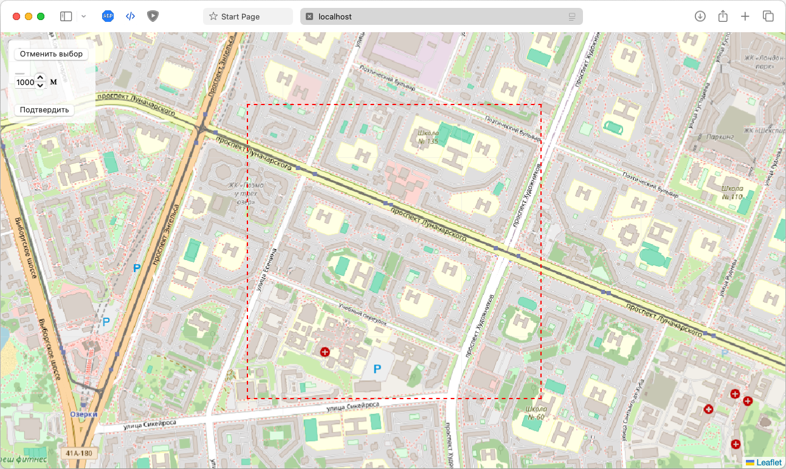
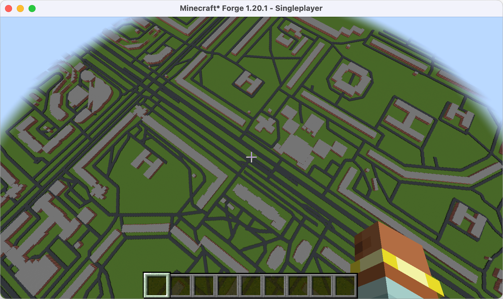

# 🌍 Проект Cartopia

## 🎯 Цель

Создание точной 3D-реконструкции участка реального мира в Minecraft с масштабом **1:1**, используя данные из различных открытых источников и технологий компьютерного зрения.

---

## 📌 Уже реализовано

- ✅ Выбор участка на карте OSM
- ✅ Загрузка зданий и дорог из Overpass API
- ✅ Генерация зданий по их точному контуру (в том числе с пустотами)
- ✅ Поддержка мультиполигонов (например, здания с внутренними дворами)
- ✅ Генерация дорог с разной шириной
- ✅ Масштаб 1:1 между реальным и игровым миром
- ✅ Сохранение результата в реальный мир Minecraft (`.mca`)

**Примеры:**

 

---

## 🧱 1. Здания

**Цель:** Правильная форма, местоположение, этажность, цвет/материал, подъезды

| Что                 | Источники / Технологии |
|----------------------|------------------------|
| **Форма и контур**     | ✅ OpenStreetMap (`building=*`) + Overpass API |
| **Этажность**          | 1️⃣ `building:levels` из OSM    2️⃣ Google Street View + CV (распознавание этажей)    3️⃣ Wikimapia    4️⃣ Microsoft Global Building Footprints |
| **Материал и цвет**    | 1️⃣ Google Street View + CV    2️⃣ Bing Streetside API    3️⃣ Wikimapia description |
| **Подъезды**           | 1️⃣ OSM `entrance=*`    2️⃣ Street View (двери, входы)    3️⃣ Wikimapia annotations |
| **Точная высота**      | 1️⃣ `height=*` из OSM    2️⃣ OpenBuildingMap    3️⃣ Расчёт на основе этажей × средняя высота |

---

## 🚗 2. Дороги

**Цель:** Реальное количество полос, ширина, повороты

| Что                   | Источники |
|------------------------|-----------|
| **Форма, повороты**     | ✅ OSM `highway=*` |
| **Ширина дороги**       | 1️⃣ `width=*` в OSM (если есть)    2️⃣ Спутниковые снимки + CV |
| **Количество полос**    | 1️⃣ `lanes=*` в OSM    2️⃣ CV по спутнику    3️⃣ Google Directions API (косвенно) |

---

## 🗻 3. Рельеф

**Цель:** Правильная высота каждого блока на всей территории

| Источники |
|------------|
| ✅ [SRTM](https://www2.jpl.nasa.gov/srtm/) (Shuttle Radar Topography Mission) |
| ✅ [Mapbox Terrain-RGB](https://docs.mapbox.com/help/glossary/terrain-rgb/) |
| ✅ [OpenTopography](https://opentopography.org/) |
| 4️⃣ Google Elevation API (ограничено по квоте) |

**🔎 Примечание:** DEM данные можно использовать для генерации растровой карты высот → масштабировать под 1 блок = 1 метр.

---

## 🌳 4. Растительность

**Цель:** Тип деревьев/кустарников, плотность, природная зона

| Что                             | Источники |
|----------------------------------|-----------|
| **Тип леса (лиственный, хвойный и т.п.)** | 1️⃣ OSM `natural=wood`, `landuse=forest`, `leaf_type=*`    2️⃣ Copernicus Land Cover    3️⃣ MODIS Land Cover |
| **Расположение деревьев**       | 1️⃣ OSM `tree=*`, `natural=tree_row`    2️⃣ CV + спутниковые снимки (NDVI)    3️⃣ Google Maps Satellite |
| **Биомы / экосистемы**          | ✅ ESA WorldCover    ✅ Global Forest Watch |

---

## 📦 5. Внутренние API

Чтобы упростить доступ к данным, создаются собственные API-эндпоинты:

| Эндпоинт             | Назначение |
|-----------------------|------------|
| `GET /buildings`      | Здания: контуры, этажи, цвета |
| `GET /roads`          | Дороги: ширина, полосы |
| `GET /terrain`        | Высотные данные |
| `GET /vegetation`     | Типы леса, плотность |
| `GET /metadata`       | Wikimapia / описание района |

---

## 🧠 Компьютерное зрение (CV)

| Задача                     | Подход / Инструмент |
|-----------------------------|---------------------|
| Распознавание этажей        | OpenCV / YOLO (окна, этажи) |
| Определение материала дома  | Semantic Segmentation (Detectron2 и др.) |
| Подсчёт полос дороги        | CNN + Hough Transform |
| Детекция деревьев           | NDVI-анализ / CV |
| Поиск подъездов/окон/дверей | Object Detection (Street View) |
