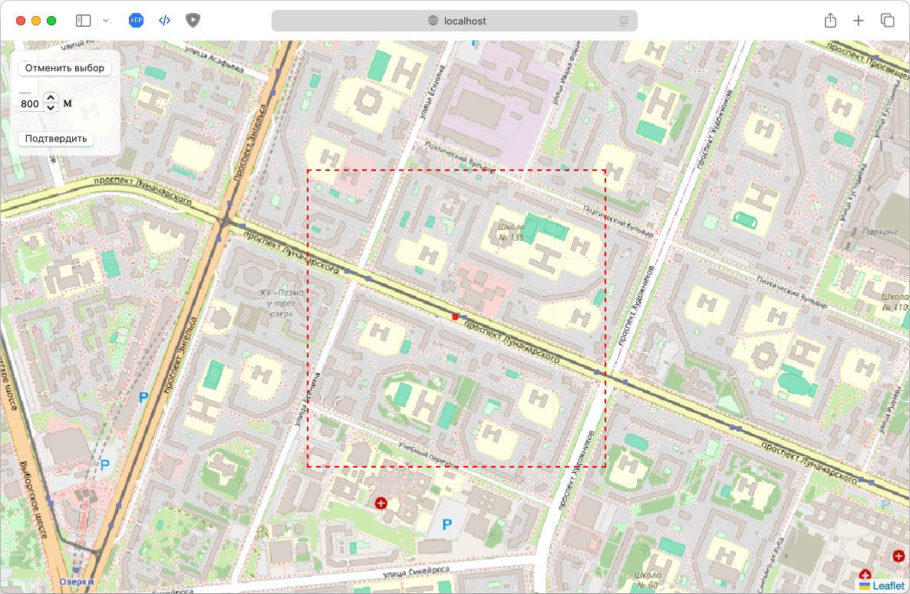
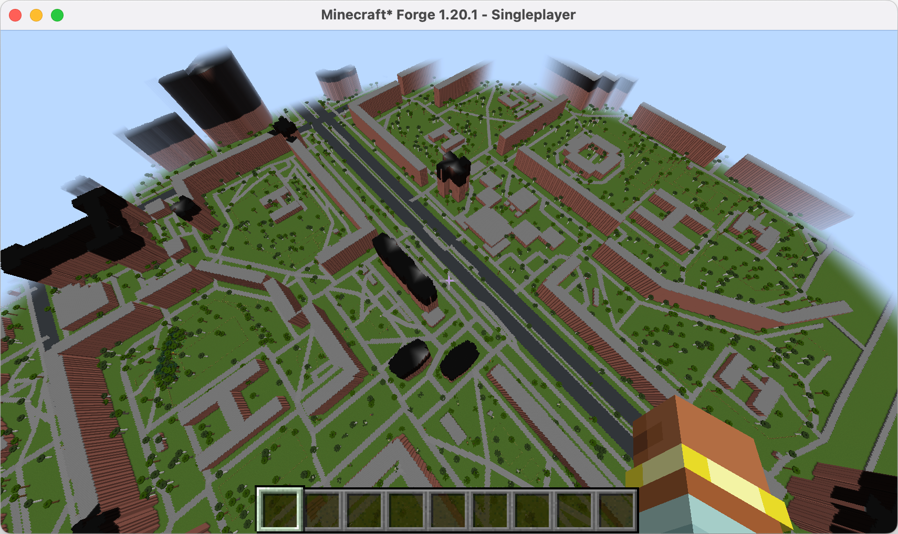
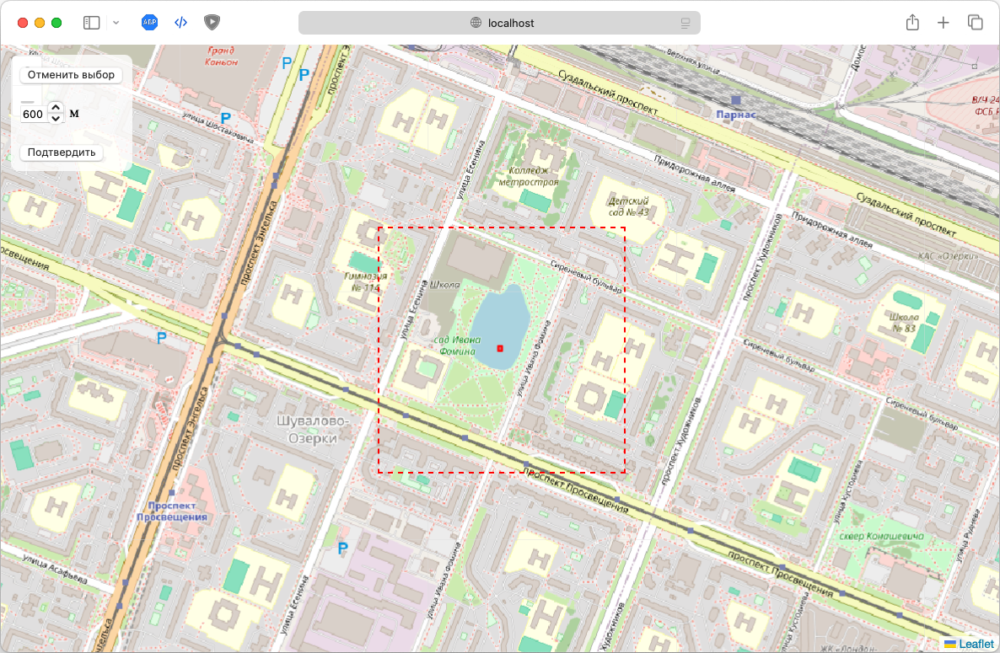
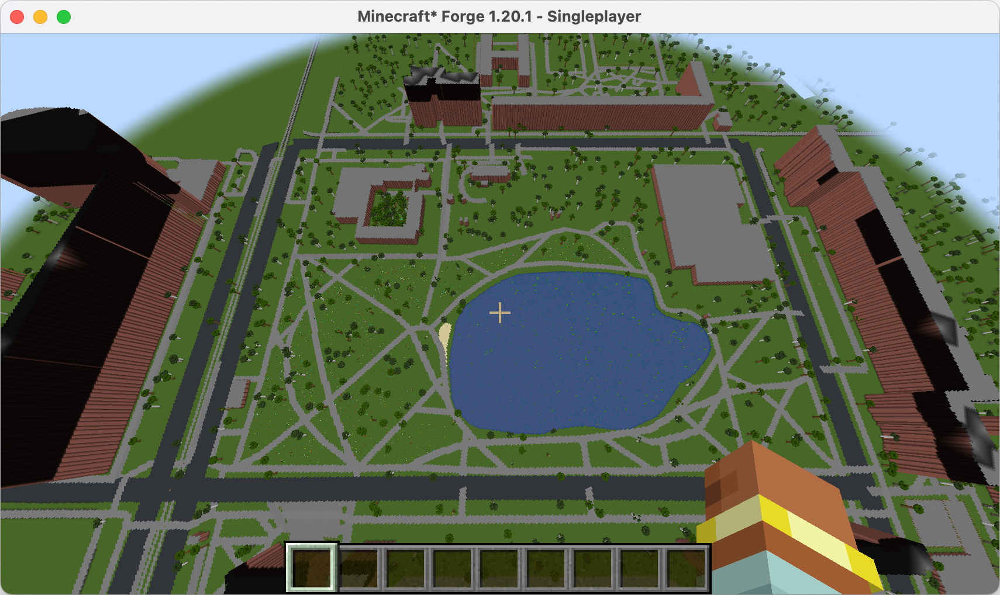

# 🌍 Проект Cartopia

## 🎯 Цель

Создание точной 3D-реконструкции участка реального мира в Minecraft с масштабом **1:1**, используя данные из различных открытых источников и технологий компьютерного зрения.

---

## 📌 Уже реализовано

- ✅ Выбор участка на карте OSM
- ✅ Загрузка зданий, дорог и других объектов из Overpass API
- ✅ Генерация зданий по их точному контуру (в том числе с пустотами)
- ✅ Поддержка мультиполигонов (например, здания с внутренними дворами)
- ✅ Генерация дорог и железных дорог с разной шириной
- ✅ Масштаб 1:1 между реальным и игровым миром
- ✅ Система ограждений для специальных зон (парки, школы и т.д.)
- ✅ Автоматическое определение этажности зданий по тегу `building:levels` (1 этаж = 3 блока)
- ✅ Генерация растительности (деревья, трава, цветы, кусты) в зависимости от типа зоны
- ✅ Сохранение результата в реальный мир Minecraft (`.mca`)

  
  

  
  

---

## 🏗 Планируется сделать

- Корректная обработка объектов с невалидными полигонами (авто-фикс или безопасное игнорирование)
- Реализация рельефа местности (экспорт высот и формирование холмов/оврагов) + Генерация мостов и многоуровневых развязок
- Доработка фасадов зданий с помощью  CV — перенос деталей и стиля по фото/карте

---
