# 🌍 Cartopia

## 🎯 Цель

Создание точной 3D-реконструкции любого участка реального мира в Minecraft с масштабом **1:1**.

---

> ⚠️ **Проект в активной разработке**  
> Инструкции и примеры будут обновляться и дополняться по мере появления стабильных (релизных) версий.

---

## 🙏 Проект Cartopia возможен благодаря:

  
  
  

- <a href="https://www.openstreetmap.org" target="_blank">OpenStreetMap</a> — свободная карта мира с огромным сообществом и открытыми данными  
  → <a href="https://wiki.openstreetmap.org/wiki/Main_Page" target="_blank">OSM Wiki</a>
- <a href="https://opentopography.org" target="_blank">OpenTopography</a> — открытый каталог цифровых моделей высот и топографических данных  
  → <a href="https://portal.opentopography.org/dataCatalog" target="_blank">Каталог данных OpenTopography</a>
- <a href="https://www.gmrt.org" target="_blank">GMRT (Global Multi-Resolution Topography)</a> — глобальная база топографических и батиметрических данных  
  → <a href="https://www.gmrt.org/services/" target="_blank">GMRT Data Services</a>  
  Данные GMRT разрабатываются и поддерживаются командами  
  <a href="https://www.marine-geo.org" target="_blank">Marine Geoscience Data System</a>,  
  <a href="https://www.iedadata.org" target="_blank">Interdisciplinary Earth Data Alliance</a>,  
  <a href="https://lamont.columbia.edu" target="_blank">Lamont-Doherty Earth Observatory</a>.

---

## 📌 Уже реализовано

- ✅ **Выбор участка:** Можно выбрать любой участок реального мира на OSM (OpenStreetMap) и задать его размер.
- ✅ **Получение данных:** Автоматическая загрузка всех объектов (здания, дороги, рельеф, зоны и др.) через Overpass API.
- ✅ **Генерация рельефа:** Импорт цифровой модели высот (DEM), корректная трансформация высот в координаты Minecraft, сглаживание резких перепадов (ступенек), формирование реалистичной поверхности.
- ✅ **Генерация зданий:**  
    - Строительство по контуру здания (с поддержкой сложных и дырявых полигонов — дворы, внутренние отверстия).
    - Поддержка мультиполигонов (например, здания с внутренними дворами или несколькими частями).
    - Автоматическое определение высоты (по тегу `building:levels`, 1 этаж = 3 блока), задание крыш.
    - Фундамент автоматически строится до "земли" (не висят в воздухе на склонах).
    - Добавляются двери (если указано во входных данных).
- ✅ **Генерация дорог и рельс:**  
    - Автоматический выбор материала и ширины дороги по типу (асфальт, брусчатка, грунтовка, тротуар, рельсы и т.д.).
    - Генерация железных дорог, включая укладку подложки и рельсов.
    - Корректная "прокладка" дорог с учетом высоты.
- ✅ **Генерация зон (ландшафт):**  
    - Все типы ландшафта: вода, песок, лес, поля, жилые, промышленные, парки, пляжи, кладбища и т.д.
    - Для каждой зоны — свой материал поверхности (автоматически).
- ✅ **Ограждения (заборы):**  
    - Вокруг специальных зон: парки, школы, кладбища, стадионы, рынки, детские площадки и т.д.
    - Генерируются строго по периметру зоны, с учетом дорог и рельс.
- ✅ **Генерация растительности:**  
    - Посев травы, папоротников, цветов, кустов — с разным распределением по типу зоны (луга, парки, леса).
    - Посадка деревьев разных типов (с поддержкой джунглей, пустынь, мангров, вишни и т.д.), плотность зависит от типа территории.
    - Водные растения (тростник у воды, бамбук, кактусы в пустыне).
- ✅ **Генерация рекреационных объектов:**  
    - В парках и лесах — своя экосистема растений и деревьев.
    - На пляжах и пустынях — песок и кактусы.
- ✅ **Поддержка пустых территорий:**  
    - Территории вне зон не остаются пустыми — засеваются деревьями и травой.
- ✅ **Сохранение мира:**  
    - Генерация идет сразу в реальный мир Minecraft (`.mca`), поддержка всех новых версий Minecraft (Java 1.20.1 и новее).
- ✅ **Масштаб 1:1:**  
    - Все объекты переносятся с точностью 1 метр = 1 блок Minecraft.
- ✅ **Ручная и автоматическая коррекция освещения:**  
    - Автоматическое пересоздание света/теней по всей области (после генерации) для корректной дневной освещённости (без багов с "черными зонами").
- ✅ **Умная работа с ошибками:**  
    - Автоматические попытки исправить невалидные полигоны зданий и зон.
    - Вывод ошибок в консоль для отладки, счетчик проблемных блоков.
- ✅ **Мультиплатформенность:**  
    - Работает на macOS (и может быть легко адаптировано под Linux/Windows).
- ✅ **Пошаговая/модульная архитектура:**  
    - Каждый этап можно запускать отдельно (например, "только пересчёт освещения" или "только генерация дорог").

---

## 🖼 Демонстрация генерации

### Станция метро "Озерки", Санкт-Петербург

  

<table>
  <tr>
    <td>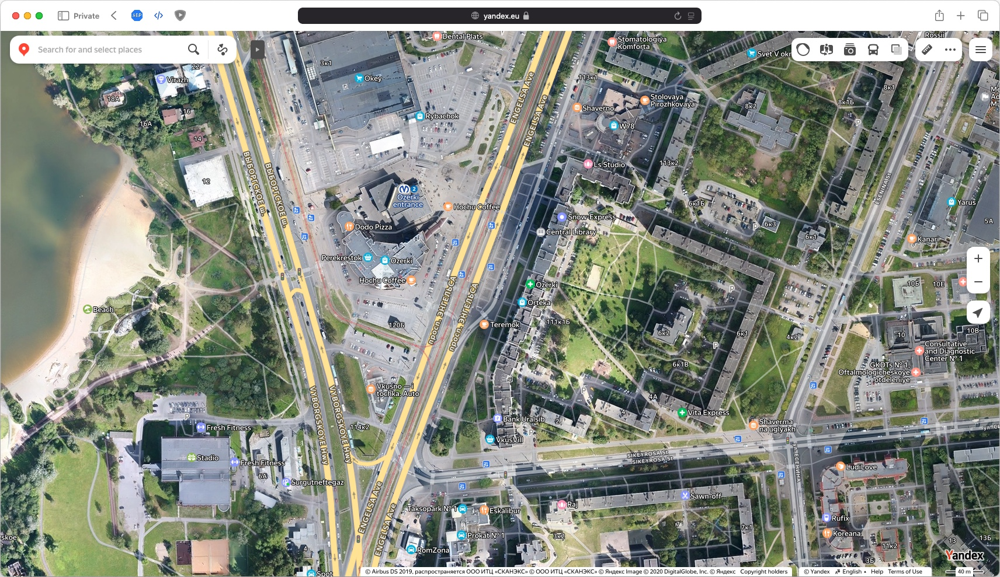</td>
    <td>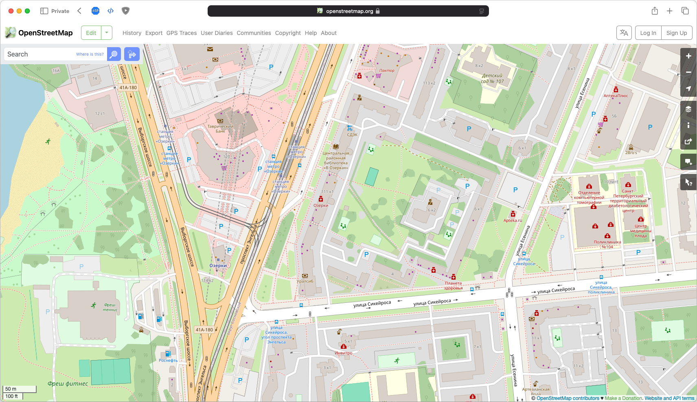</td>
  </tr>
</table>

---

### Парк Ивана Фомина, Санкт-Петербург

  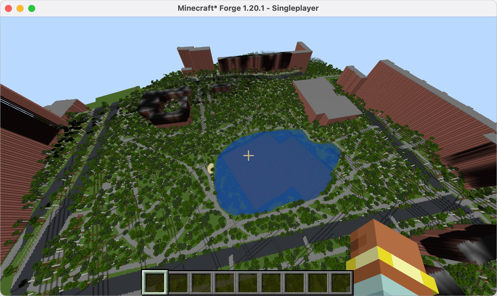

<table>
  <tr>
    <td>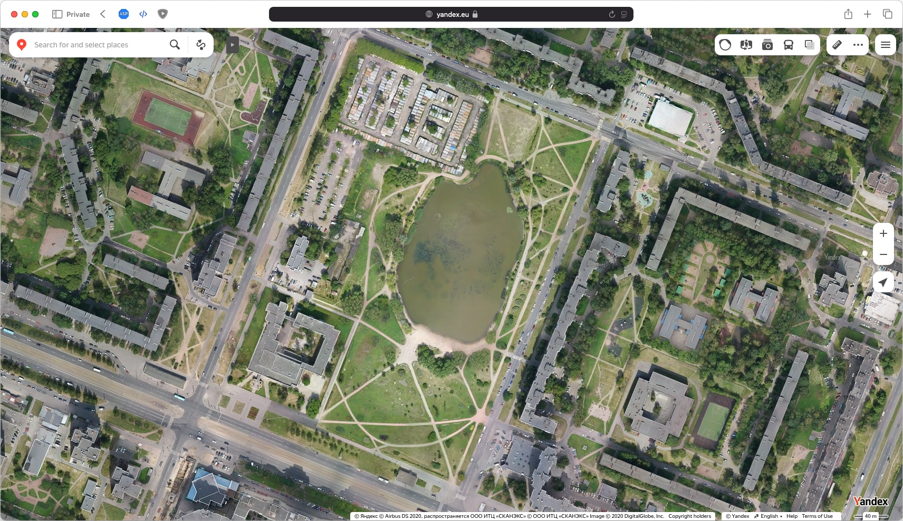</td>
    <td>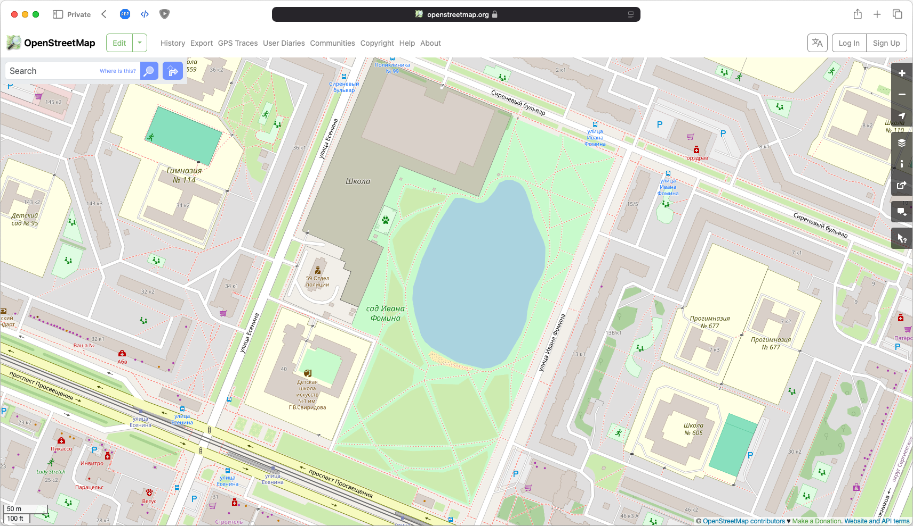</td>
  </tr>
</table>

---

### Поклонная гора, проспект Энгельса, Санкт-Петербург (демонстрация рельефа)

<table>
  <tr>
    <td>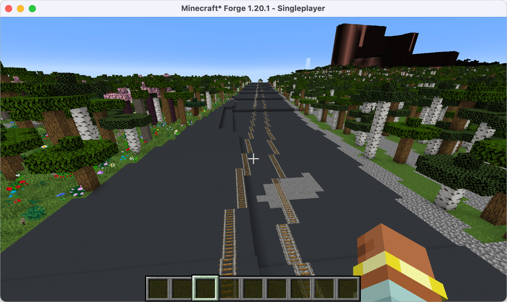</td>
    <td>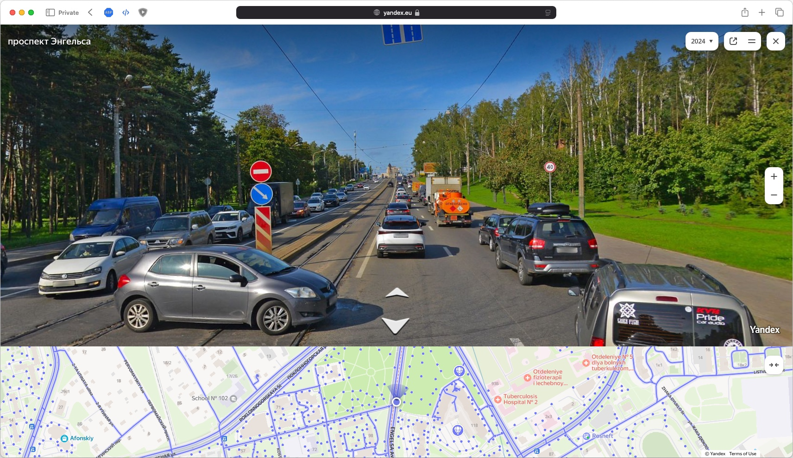</td>
  </tr>
</table>

---

### Часть Выборгского района, над проспектом Луначарского, 60, Санкт-Петербург

  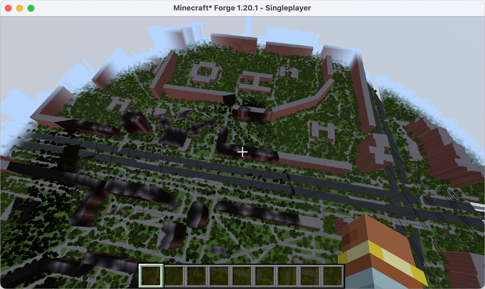

<table>
  <tr>
    <td>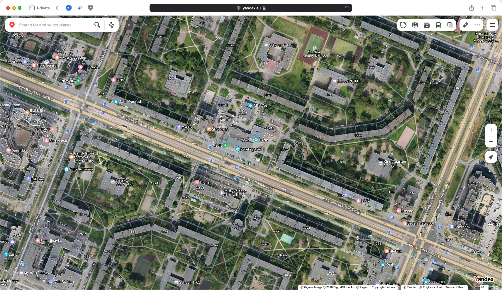</td>
    <td>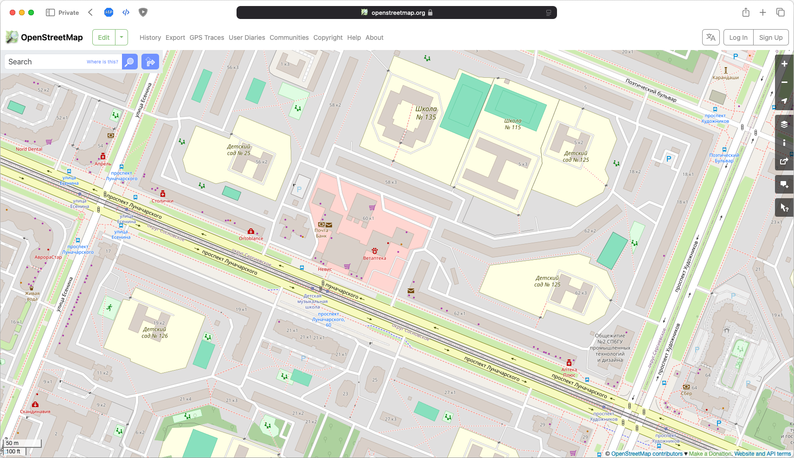</td>
  </tr>
</table>

---

### Примеры объектов

#### Рельсы и карта участка

<table>
  <tr>
    <td>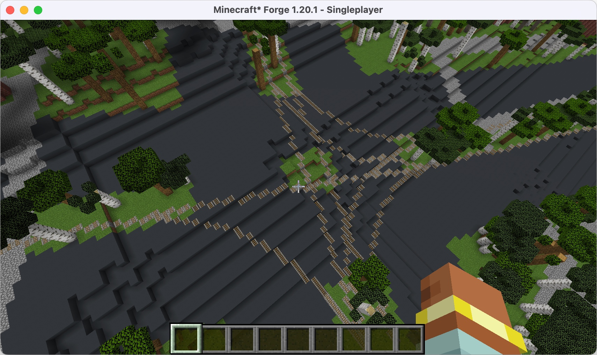</td>
    <td>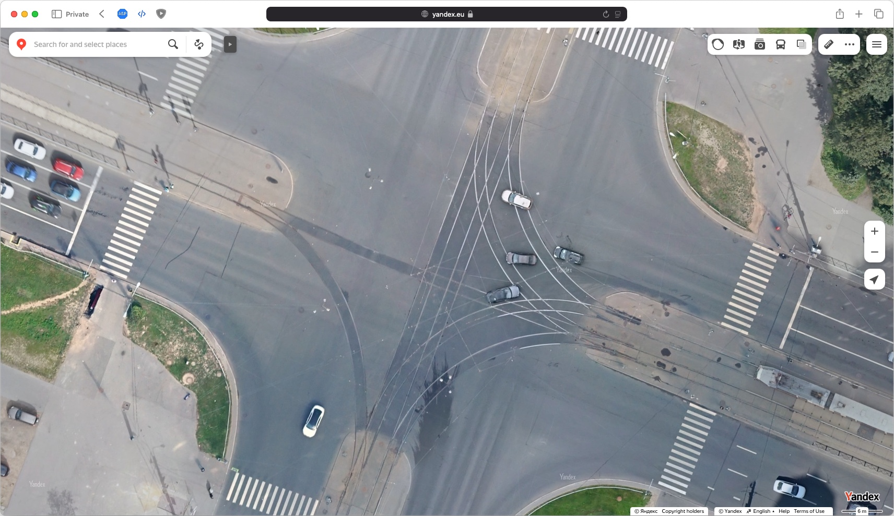</td>
  </tr>
</table>

#### Пример ограждения зоны (вокруг парков/парковок/школ/больниц и др. зон)

  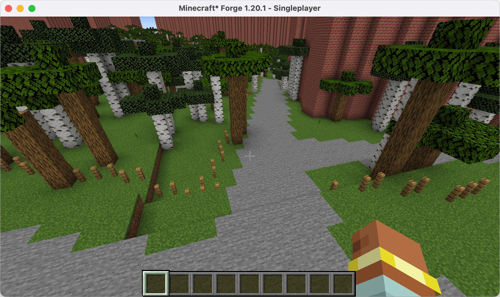

---

## 🏗 Планируется сделать

- Инфраструктура. (22 шт)
- Внешний вид зданий
- Обработка зданий с невалидными полигонами - достраивать форму и высоту
- Время, Погода
---