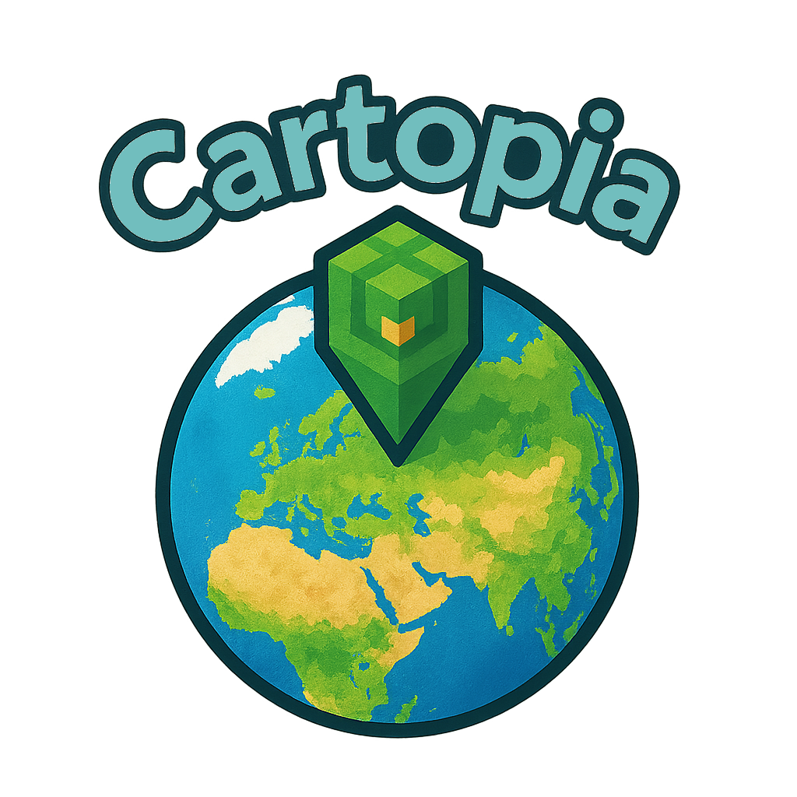
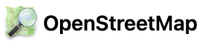

    
  
  

 

# Cartopia - реальный мир в Minecraft 1.20.1 (Forge) в масштабе 1:1

**Cartopia** - мод для Minecraft 1.20.1 (Forge), который позволяет генерировать любой участок земной поверхности прямо в игре, в масштабе 1:1, с учётом реального рельефа, актуального времени, погодных условий и всех строений и инфраструктуры*.  
Воссоздаются города и природные территории максимально полно: здания нужной формы (включая составные части и сложные контуры), дорожно-железнодорожная сеть с корректным продольным профилем и отметками высоты относительно рельефа; инженерная и городская инфраструктура в соответствии с топологией объектов; растительность моделируется с учётом типов насаждений, а форма местности следует реальному рельефу. Игровое время и погодные условия синхронизируются с реальными в выбранной зоне. Всё формируется по данным открытых источников.

Проводите виртуальные экспедиции и создавайте кинематографичные кадры и сцены - **Cartopia** создана для любопытства и исследований.

 

## Ключевые особенности*  
- **Масштаб 1:1** - реальные расстояния и очертания местности переносятся в игровой мир.
- **Рельеф** - цифровые модели высот используются для формирования естественного ландшафта.
- **Города и инфраструктура** - дороги, кварталы, застройка, растительность и объекты вплоть до мельчайших деталей.
- **Время и погода** - синхронизация с реальными условиями на выбранной территории.
- **Удобный веб-интерфейс** - выбор области на карте, поиск по топонимам, наглядные параметры генерации.
- **Гибкость** - генерируется именно та местность, которая интересна.

 
  

---

 
 

## Примеры генерации

<table>
  <thead>
    <tr>
      <th>Сгенерировано (Cartopia)</th>
      <th>Панорама местности</th>
    </tr>
  </thead>
  <tbody>
    <!-- Блок 1 -->
    <tr>
      <th colspan="2" align="center">Вид с эспланады комплекса «Куала-Лумпур Сити-центр» на Башни Петронас - Куала-Лумпур, Малайзия.</th>
    </tr>
    <tr>
      <td align="center">
        
      </td>
      <td align="center">
        
      </td>
    </tr>
    <!-- Блок 2 -->
    <tr>
      <th colspan="2" align="center">Вид с набережной у озера Бурдж-Халифа - Дубай, ОАЭ.</th>
    </tr>
    <tr>
      <td align="center">
        
      </td>
      <td align="center">
        
      </td>
    </tr>
    <!-- Блок 3 -->
    <tr>
      <th colspan="2" align="center">Вид сверху на Бурдж-Халифу и озеро Бурдж с комплексом «Поющих фонтанов Дубая» - Дубай, ОАЭ.</th>
    </tr>
    <tr>
      <td align="center">
        
      </td>
      <td align="center">
        
      </td>
    </tr>
    <!-- Блок 4 -->
    <tr>
      <th colspan="2" align="center">Вид с обзорной площадки «Топ-оф-зе-Рок» (Рокфеллер-центр) на Эмпайр-стейт-билдинг и Нижний Манхэттен - Нью-Йорк, США.</th>
    </tr>
    <tr>
      <td align="center">
        
      </td>
      <td align="center">
        
      </td>
    </tr>
    <!-- Блок 5 -->
    <tr>
      <th colspan="2" align="center">Вид со стороны Финского залива на «Лахта-центр» - Санкт-Петербург, Россия.</th>
    </tr>
    <tr>
      <td align="center">
        
      </td>
      <td align="center">
        
      </td>
    </tr>
    <!-- Блок 6 -->
    <tr>
      <th colspan="2" align="center">Москва-Сити - вид снизу у башни «Меркурий» (Пресненская набережная), Москва, Россия.</th>
    </tr>
    <tr>
      <td align="center">
        
      </td>
      <td align="center">
        
      </td>
    </tr>
    <!-- Блок 7 -->
    <tr>
      <th colspan="2" align="center">Вид сверху на Исаакиевский собор и Исаакиевскую площадь - Санкт-Петербург, Россия.</th>
    </tr>
    <tr>
      <td align="center">
        
      </td>
      <td align="center">
        
      </td>
    </tr>
    <!-- Блок 8 -->
    <tr>
      <th colspan="2" align="center">Марсово поле и Летний сад, вид к Троицкому мосту и Петропавловской крепости - Санкт-Петербург, Россия.</th>
    </tr>
    <tr>
      <td align="center">
        
      </td>
      <td align="center">
        
      </td>
    </tr>
    <!-- Блок 9 -->
    <tr>
      <th colspan="2" align="center">Аллея Летнего сада, вид к Кофейному домику - Санкт-Петербург, Россия.</th>
    </tr>
    <tr>
      <td align="center">
        
      </td>
      <td align="center">
        
      </td>
    </tr>
    <!-- Блок 10 -->
    <tr>
      <th colspan="2" align="center">Петропавловская крепость на Заячьем острове - Санкт-Петербург, Россия.</th>
    </tr>
    <tr>
      <td align="center">
        
      </td>
      <td align="center">
        
      </td>
    </tr>
    <!-- Блок 11 -->
    <tr>
      <th colspan="2" align="center">Зимний дворец и Дворцовая площадь с Александровской колонной - Санкт-Петербург, Россия.</th>
    </tr>
    <tr>
      <td align="center">
        
      </td>
      <td align="center">
        
      </td>
    </tr>
    <!-- Блок 12 -->
    <tr>
      <th colspan="2" align="center">Лондонский Тауэр и Тауэрский мост - Лондон, Великобритания.</th>
    </tr>
    <tr>
      <td align="center">
        
      </td>
      <td align="center">
        
      </td>
    </tr>
    <!-- Блок 13 -->
    <tr>
      <th colspan="2" align="center">Ломбард-стрит (извилистый участок на Русском холме) - Сан-Франциско, США.</th>
    </tr>
    <tr>
      <td align="center">
        
      </td>
      <td align="center">
        
      </td>
    </tr>
    <!-- Блок 14 -->
    <tr>
      <th colspan="2" align="center">Канатные трамваи на улице Калифорния-стрит, вид в сторону Ноб-Хилла - Сан-Франциско, США.</th>
    </tr>
    <tr>
      <td align="center">
        
      </td>
      <td align="center">
        
      </td>
    </tr>
    <!-- Блок 15 -->
    <tr>
      <th colspan="2" align="center">Многоуровневая развязка МКАД и Ярославского шоссе - Москва, Россия.</th>
    </tr>
    <tr>
      <td align="center">
        
      </td>
      <td align="center">
        
      </td>
    </tr>
    <!-- Блок 16 -->
    <tr>
      <th colspan="2" align="center">Многоуровневая развязка эстакад в районе Пуси - Шанхай, Китай.</th>
    </tr>
    <tr>
      <td align="center">
        
      </td>
      <td align="center">
        
      </td>
    </tr>
    <!-- Блок 17 -->
    <tr>
      <th colspan="2" align="center">Перекрёсток проспекта Энгельса и проспекта Луначарского - Санкт-Петербург, Россия.</th>
    </tr>
    <tr>
      <td align="center">
        
      </td>
      <td align="center">
        
      </td>
    </tr>
    <!-- Блок 18 -->
    <tr>
      <th colspan="2" align="center">Вид на кварталы Чертаново Северное со стороны Кировоградской улицы, в сторону Битцевского лесопарка - Москва, Россия.</th>
    </tr>
    <tr>
      <td align="center">
        
      </td>
      <td align="center">
        
      </td>
    </tr>

  </tbody>
</table>

 
  

---

 
 

## Установка и запуск

1. Скачайте последний релиз Cartopia из раздела [Releases](https://github.com/TheAndreyZakharov/Cartopia/releases).
2. Установите Minecraft 1.20.1 и Forge 47.4.0 (ветка для 1.20.1).
3. Поместите файл мода `cartopia_x.x.x_mc1.20.1_forge47.jar` в папку `mods/` вашего профиля Minecraft.
4. Запустите игру и создайте **новый мир** со следующими параметрами:
   - **Game Mode:** Creative  
   - **Difficulty:** Peaceful  
   - **Allow Cheats:** ON  
   - **World Type:** Superflat  
   - **Generate Structures:** OFF
5. Войдите в мир и **следуйте подсказкам мода** для выбора области и запуска генерации.
> **Рекомендация:** начните с генерации небольшой области (например, квадрат до 300–500 м по стороне) и убедитесь, что всё работает примерно как ожидается. После проверки переходите к более крупным регионам - чрезмерно большие окна сразу могут обрабатываться долго и/или приводить к отказам внешних сервисов.
> **Примечание:** результат может чуть варьироваться между повторами даже при тех же параметрах (случайные материалы, сглаживание рельефа/воды).

 

## Рекомендуемые дополнения (моды и датапаки)

Ниже - дополнения, которые обычно помогают раскрыть Cartopia на полную. **Подбирайте версии строго под Minecraft 1.20.1 (Forge).**

- **HigherHightsUltimate** (датапак увеличения высоты мира).  
  Нужен, чтобы небоскрёбы и высокие объекты генерировались полностью.  
  _Установка:_ создайте мир → выйдите из него (или из игры в целом) → поместите `.zip` датапака в `saves/<имя_мира>/datapacks/` → запустите мир снова → затем запускайте генерацию.

- **DistantHorizons** (LOD-дальняя прорисовка).  
  Позволяет видеть огромные территории без критичного падения FPS.  
  _Установка:_ положите `.jar` в папку `mods/` рядом с Cartopia.  
  _Примечание:_ совместимость с некоторыми шейдерами ограничена - проверяйте конкретные связки.

- **Шейдеры** (на вкус и под задачу).  
  Улучшают кинематографичность и читаемость сцен.  
  _Установка:_ архив шейдера в `shaderpacks/`. Часто требуется **OptiFine** (или совместимый аналог для Forge).  
  _Примечание:_ не все шейдеры дружат с **DistantHorizons** - сверяйтесь с документацией выбранного шейдера/мода.

> **Важно:** большие окна генерации + тяжёлые шейдеры + дальняя прорисовка могут потребовать мощного ПК и тонкой настройки графики.

**Параметры и инструменты «Примеров генерации»:**

- **Шейдеры:** *Complementary Shaders* с отключёнными дополнительными эффектами (туман, блум/засветы и т. п.). Пак доступен в вариантах для x86-64 (Windows/Linux) и ARM64 (например, Apple Silicon).
- **Дальняя прорисовка:** без *DistantHorizons*; стандартная дальность рендера - 64 чанка.
- **Высотный датапак:** в отдельных сценах использовался *HigherHightsUltimate* для корректной высоты высоких объектов.
- **Поле зрения (FOV):** для более точного совпадения с референс-фото FOV подбирался индивидуально для каждого скриншота (от «узкого» телеракурса до широкого угла). Это влияет на перспективное сжатие и композицию.
- **Примечание:** итоговая картинка может немного отличаться из-за ваших настроек шейдеров, графики и калибровки дисплея.

 
  

---

 
 

## Важное предупреждение об использовании

Cartopia предназначен для **обучения, исследований, виртуальных путешествий и творческих проектов**.

**Пользовательские правила и нормы:**
- **Уважение и корректность.** Недопустимы осквернение искажения и умышленное «очернение» реальных городов, памятников, религиозных и культурных объектов, кладбищ, мемориалов и т.п.
- **Этика и религия.** Соблюдать моральные, этические и религиозные нормы. Не допускать действий, которые могут быть восприняты как неуважение к вере, культуре или традициям.
- **Нулевая терпимость к злоупотреблениям.** Запрещены любые формы ненависти, дискриминации, пропаганды насилия, травли и разжигания вражды в созданных мирах.
- **Чувствительные локации.** С осторожностью относиться к местам трагедий, зонам конфликтов и стихийных бедствий - избегать тривиализации и «игрового» использования таких пространств.
- **Конфиденциальность и безопасность.** Не использовать сгенерированные данные для слежки, нарушения частной жизни или планирования противоправной деятельности. Принцип - «не навреди».

**Лицензии и атрибуция:**
- Соблюдать лицензии источников, ресурсов, инструментов и правила площадок, где публикуется контент.  

**Ответственность и позиция автора:**
- Мод - это инструмент. Автор не поощряет и не несёт ответственности за неэтичное или противоправное использование результатов генерации.
- Карты, границы, топонимы и любые геополитические обозначения в моде не выражают политических взглядов автора и не являются заявлением позиции; они отражают открытые данные, преимущественно наполняемые сообществом (напр., OSM), и используются исключительно как техническая основа без оценочных суждений или одобрения какой-либо стороны.
- Если при генерации допущена значимая недостоверность по вине алгоритмов (а не исходных данных), приносятся заранее глубокие извинения: учесть все случаи реального мира крайне сложно; подобные ситуации не являются умышленными.

**Обратная связь:**
- При обнаружении ошибок, неточностей или спорных случаев корректнее сообщить о проблеме (issue/bug report) и помочь улучшить мод, а не пытаться «исправлять» ситуацию неэтичными способами.

 
  

---

 
 

## Интерфейсы и элементы управления Cartopia

**Окно мода в списке Mods.**  

  

Так выглядит карточка Cartopia в стандартном меню всех установленных модов: показаны название, версия, ModID, лицензия, кредиты и ссылки на репозиторий. Появление этой записи означает, что мод загружен и активен.

**Системные сообщения при входе в мир.**  

  

При активном моде Cartopia сразу после загрузки мира в чате появляются сообщения о готовности мода и подсказка по клавише вызова меню. Это подтверждает, что мод инициализировался корректно.

**Меню Cartopia в игре (клавиша `M`).**  

  

Слева - краткий гид по использованию: пошаговые подсказки и предупреждения. Справа - кнопка Open Map для запуска веб-карты и переключатель Real-world time/weather (включает/выключает синхронизацию времени и погоды с реальными условиями).
Далее по гайду: нажать Open Map.

**Окно подтверждения открытия ссылки.**  

  

После клика по ссылке в игре появляется системный диалог с адресом `http://127.0.0.1:4567`. Доступны варианты:
- Open in Browser - открыть ссылку в браузере (рекомендуется);
- Copy to Clipboard - скопировать адрес в буфер обмена;
- Cancel - отменить.

Для перехода к веб-карте нажать Open in Browser.

**Веб-карта: стартовый экран.**  

  

После нажатия «Open in Browser» открывается страница `http://127.0.0.1:4567` с картой мира и плавающей панелью управления справа.

**Панель управления: общий вид.**  

  

В правой части страницы располагается плавающая панель - через неё удобно управлять всеми основными функциями (тема, поиск, выбор области, масштаб, размер окна, подтверждение). 
Далее в разделе каждая кнопка и поле ввода разбирается поэтапно.

**Поиск места.**

  

 Введите в поле Search for a city, address, or coordinates название города, адрес или координаты и нажмите Find (или клавишу Enter) - карта переместится к найденной точке.

 **Тёмная тема интерфейса.**

  

Панель поддерживает тёмную тему: она автоматически следует системным настройкам и, при необходимости, может быть переключена вручную кнопкой Enable light/dark theme вверху панели.

**Выбор области на карте.**

  
  

Сначала нажмите Select area (как на левом скриншоте). Затем на карте появится пунктирный квадрат - это границы области, которую вы будете генерировать. Маленький закрашенный квадратик в центре - ориентировочная точка появления игрока и «якорь» для синхронизации времени и погоды внутри выбранной зоны.  
После активации выборки кнопка Select area изменится на Cancel selection - нажмите её, чтобы отменить выбор и убрать квадрат с карты.

**Масштаб карты.**

  

Кнопки Zoom in и Zoom out изменяют масштаб карты так же, как прокрутка колёсиком мыши/жестом на трекпаде: приближают и отдаляют вид вокруг текущего центра экрана.

**Размер области.**

  

В поле Side length (meters) задаётся сторона пунктирного квадрата на карте - то есть границы области генерации.  
По умолчанию - 500 м, минимально - 200 м. Значение можно ввести вручную или менять кнопками – / + (шаг 100 м). Под полем отображается расчёт примерной площади, а пунктирный квадрат на карте автоматически меняет размер.

**Подтверждение выбора.**

  

Нажмите Confirm, чтобы зафиксировать текущую область.  
После этого начнётся подготовка и скачивание необходимых данных (карта/рельеф/служебные файлы) и отправка параметров в игру. Дождитесь сообщения об успешном сохранении и не закрывайте страницу до завершения шага.

**Уведомление о сохранении.**

  

После нажатия Confirm при успешной выгрузке появится окно “Saved!”.  
Это означает, что выбранная область сохранена, нужные данные скачаны и переданы в игру - процесс генерации начинается. Нажмите OK (или клавишу Enter) и вернитесь в Minecraft; не покидайте мир до завершения генерации.

**Сообщения о ходе генерации.**

  

Во время генерации в чате выводятся служебные сообщения о текущем этапе - это помогает понять, что происходит прямо сейчас. Признак успешного завершения - подряд появляются строки:  
`[Cartopia] Saving world...` → `Generation finished.` → `Generation finished. Package: area_...`  
Когда эти сообщения появятся - генерация завершена, данные сохранены; дайте области немного времени на прогрузку (персонаж может «подстроиться» по высоте с небольшой задержкой), после чего можно продолжать игру.

**Скрытие панели управления.**

  <table>
    <tr>
      <td align="center" valign="top">
        
      </td>
      <td align="center" valign="top">
        
      </td>
    </tr>
  </table>

Иногда для удобного изучения карты панель можно временно скрыть - нажмите на круглую стрелку в левом верхнем углу панели. Нажмите её снова, чтобы вернуть панель.

**Перемещение панели управления.**

  <table>
    <tr>
      <td align="center" valign="top">
        
      </td>
      <td align="center" valign="top">
        
      </td>
    </tr>
  </table>

Панель можно перетащить в удобное место: зажмите мышью иконку-крестик в правом верхнем углу панели и перетащите её.  
Если хотите быстро вернуть панель в расположение по умолчанию - скройте её стрелкой и снова раскройте: при разворачивании положение сбросится к дефолтному.

 
  

---

 
 

## Как работает Cartopia

1. При запуске мира поднимается локальный веб-сервер (на `localhost`), который предоставляет браузерный интерфейс выбора региона, масштаба и параметров генерации.  
2. В интерфейсе выделяется область на карте (поддерживается поиск по топонимам). Формируется пакет параметров: координаты, размер окна, системные опции.  
3. Скачивается DEM (цифровая модель рельефа) для выбранных границ, при наличии инструментов вырезается растровый слой покровов (landcover) под прямоугольник.  
4. Через Overpass/Nominatim запрашиваются данные OpenStreetMap: дороги, здания, рельсы, водные объекты, POI и т.д.  
5. Данные приводятся к служебным форматам («сайдкары»), затем запускается Cartopia Pipeline (см. следующий раздел).  
6. После отрисовки поверхности игроки перемещаются на безопасную отметку в сгенерированной области.  
7. Контроллер времени и погоды периодически обновляет условия.
8. Мир сохраняется, выполняется сервисная очистка выпавших предметов.

 

## Этапы генерации (Cartopia Pipeline - полный перечень)

- **Подготовка:**
  - Загрузка координат/параметров.
  - Подготовка «сайдкаров» (NDJSON c фичами, сетка рельефа).
- **Рельеф и старт:**
  - `SurfaceGenerator` - генерация поверхности (DEM + окраска по landcover).  
  - `CartopiaSurfaceSpawn.adjustAllPlayersAsync` - подъём игроков на безопасную поверхность.
- **Дороги и транспортные линии:**
  - `RoadGenerator` - дороги.
  - `RailGenerator` - железные дороги.
  - `PierGenerator` - пирсы.
- **Дорожная разметка и площадки:**
  - `CrosswalkGenerator` - пешеходные переходы.
  - `StopMarkingGenerator` - разметка у остановок.
  - `RailStopLineGenerator` - стоп-линии на ЖД-переездах.
  - `HelipadGenerator` - вертолётные площадки.
  - `ParkingStallGenerator` - разметка парковочных мест.
- **Мосты и тоннели:**
  - `BridgeGenerator` - мосты/многоуровневые эстакады.
  - `TunnelGenerator` - тоннели/подземные переходы.
  - `RoadButtonMarkingGenerator` - дорожная разметка.
- **Здания:**
  - `BuildingGenerator` - генерация зданий (включая составные части).
- **Освещение:**
  - `RoadLampGenerator` - уличные фонари вдоль дорог.
  - `RailLampGenerator` - фонари вдоль рельсов.
- **Инфраструктура и объекты:**
  - `UtilityBoxGenerator` - уличные утилитарные боксы.
  - `LighthouseGenerator` - маяки.
  - `WindTurbineGenerator` - ветротурбины.
  - `ClassicWindmillGenerator` - классические ветряные мельницы.
  - `WatchtowerGenerator` - наблюдательные вышки.
  - `ChimneyGenerator` - трубы/дымоходы.
  - `TowerMastGenerator` - башни/мачты.
  - `UtilityTankTowerGenerator` - башни-резервуары.
  - `SolarPanelGenerator` - солнечные панели/поля.
  - `SubstationGenerator` - электроподстанции.
  - `PowerLinesGenerator` - линии электропередачи (опоры/вышки/провода).
  - `FuelPumpGenerator` - топливораздаточные колонки на АЗС.
  - `CarWashGenerator` - автомойки.
  - `ElectricChargerGenerator` - электрозарядные станции.
  - `LeisureRestGenerator` - зоны отдыха: скамейки, столы, BBQ, беседки, палатки.
  - `BeachResortGenerator` - пляжные зоны (лежаки и пр.).
  - `SportsFacilitiesGenerator` - спортплощадки (футбол, баскетбол, теннис, волейбол/бадминтон, гольф, стрельбища, фитнес).
  - `WasteGenerator` - мусорная инфраструктура (урны, площадки, переработка).
  - `OvergroundPipelinesGenerator` - надземные трубопроводы.
  - `PublicTransportShelterGenerator` - остановочные павильоны.
  - `TrafficLightGenerator` - светофоры.
  - `FlagpoleGenerator` - флагштоки.
  - `AddressPointBuildingsGenerator` - простые дома по адресным точкам.
  - `FenceAndBarrierGenerator` - ограждения, заборы, отбойники.
  - `CemeteryGravesGenerator` - кладбища (надгробия).
  - `WaterSourcesGenerator` - источники воды (колонки/колодцы/питьевые точки).
  - `TrafficCalmingGenerator` - успокоители трафика.
  - `FireHydrantGenerator` - пожарные гидранты.
  - `ParkingMetersGenerator` - паркоматы/терминалы оплаты.
  - `BicycleParkingGenerator` - велопарковки.
  - `PostBoxGenerator` - почтовые ящики.
  - `CameraGenerator` - камеры (скорости/видеонаблюдение).
  - `InfoBoardsGenerator` - инфостенды/табло/указатели.
  - `ApiaryBeehivesGenerator` - ульи и пасеки.
  - `MiningOresScatterGenerator` - карьеры/шахты/минеральные объекты.
  - `WindsockFlagsGenerator` - аэродромные ветроуказатели.
  - `ConstructionSiteDecorator` - оформление стройплощадок.
  - `CraneGenerator` - краны.
  - `AdvertisingGenerator` - рекламные конструкции.
  - `FountainGenerator` - фонтаны.
  - `MonumentGenerator` - памятники/арт-объекты/монументы.
  - `AerialwayGenerator` - подъёмники (канатные дороги).
  - `CaveEntranceGenerator` - входы в пещеры.
- **Растительность:**
  - `VegetationScatterGenerator` - рассадка растительности.
- **Время и погода:**
  - `WeatherTimeController.start` - контроллер реального времени и погоды.
- **Завершение:**
  - Сохранение мира.
  - `DroppedEntitiesCleaner.schedule` - очистка выпавших предметов (несколько проходов).

 
  

---

 
 

## * - Ограничения и примечания  

- **Масштаб 1:1.** Один блок Minecraft соответствует ≈ 1 метру: расстояния и размеры объектов передаются без масштабирования; высоты берутся из DEM в метрах (с возможным лёгким сглаживанием для играбельности).
 
- **Географические границы.** Поддерживается генерация между 60° ю. ш. и 85° с. ш.; области южнее 60° ю. ш. и севернее 85° с. ш. не рассматриваются. Это связано с ограничениями данных и проекций в полярных зонах.  

- **Сглаживание рельефа и водных поверхностей.** Реальные высоты адаптируются: сглаживаются резкие перепады, чтобы сохранить характер местности и сделать ландшафт играбельным. Вода обрабатывается отдельным алгоритмом: если сглаживать её как поверхность, из воды могут получаться «горы», затапливающие мосты и побережья. Для участков где вода преимущественна, уровень стремится к максимально ровному, но учитывает различную высоту берегов. Также уровень рассчитывается от нижних отметок русла и плавно «подтягивается» к берегам (в сложных местах возможно визуальное ощущение «воронки» — это компромисс между реализмом и игровыми ограничениями). Чтобы снизить риск затоплений, уровень воды дополнительно опускается на 1 блок относительно близлежащего рельефа. 

- **Разрешение рельефа и размер окна.** Источники DEM имеют переменное разрешение. На очень маленьких окнах (сотни метров) в зонах с редкой сеткой высот поверхность может сгладиться и «уехать» под наклон/ступень или дать ложную «горку». Решение: увеличьте сторону области (например, в 2–4 раза) - в выборку попадёт больше узлов рельефа, и профиль станет корректнее.

- **Время и погода.** Данные синхронизируются с внешними источниками раз в час и применяются плавно, поэтому изменения условий не происходят моментально. В Minecraft используется единая модель осадков: в игре существует только «дождь», а отображение снега определяется биомом; в суперплоском мире Cartopia биом фиксирован тёплым, поэтому любые осадки видны как дождь. Биомы не меняются в зависимости от времени года реального мира. Суточный цикл управляется игровым временем Minecraft (условно «летний» режим), из-за чего закаты/рассветы и положение солнца могут отличаться от реальных для выбранной территории.

- **Детализация объектов.** Полнота, точность и актуальность зависят от открытых источников и активности локальных сообществ картографов. В регионах с развитым сообществом обычно присутствуют более детальные атрибуты (например, высотность/этажность зданий, типы покрытий, мелкие элементы инфраструктуры), регулярные обновления и аккуратные теги; в менее покрытых областях возможны упрощения, пропуски и несоответствия. Поэтому уровень детализации и качество генерации могут заметно различаться даже в пределах одной страны.  

- **Материалы/цвета, высота и унификация объектов.** Для зданий используется каталог дефолтных материалов и оттенков: если атрибуты не указаны - сочетание выбирается случайно из допустимого набора. Если задан материал - подбирается близкий материал; если задан цвет - подбирается оттенок; при одновременном указании приоритет у цвета. Высота: по умолчанию здание строится как 2 этажа. Если указано `building:levels` - используем этажность; если задана абсолютная `height` - строим по высоте; при наличии обоих параметров приоритет у этажности. Небольшие постройки и элементы инфраструктуры (урны, остановки, опоры и т. п.) часто помечены типовым тегом без детального описания, поэтому их дизайн унифицирован.

- **Тестовое покрытие и теги OSM.** Мод разрабатывался и отлаживался преимущественно на данных Санкт-Петербурга, Москвы, Карелии (особенно Сортавала), Казани и Набережных Челнов; дополнительно использовались точечные участки в Китае, США, Индии и ряде других стран. Основной референс - схемы тегов и рекомендации OSM Wiki. Поэтому, если в конкретном регионе распространены иные локальные/частные теги или нестандартные схемы разметки, итоговая генерация может отличаться от ожидаемой.

- **Повторяемость/вариативность генерации.** Даже при одинаковой области и настройках между прогонами возможны небольшие визуальные отличия: выбор материалов из допустимого набора, нюансы сглаживания рельефа/воды, точные позиции мелких объектов, порядок объединения геометрий — на это влияют случайные процедуры, момент запроса и свежесть данных OSM. Небольшой сдвиг/изменение размера окна тоже меняет результат.

- **Повторная генерация в одном мире.** Новые области строятся в фиксированных координатах игрового мира. При повторном запуске генерации в том же сохранении (даже для другой реальной локации) построение произойдёт в тех же игровых координатах и может полностью или частично перезаписать уже существующую территорию. Чтобы сохранить ранее сгенерированное - используйте отдельный мир/сохранение.

- **Внешние сервисы и доступность данных.** Иногда картографические/метеорологические/топографические API могут временно отвечать ошибками или отдавать неполные данные. В результате выгрузка и генерация могут получиться некорректными. В таком случае стоит повторить генерацию той же области 1–2 раза; если проблема сохраняется, подождать и попробовать позже.  

- **О точности алгоритмов.** Если при генерации была допущена значимая недостоверность, обусловленная не исходными данными, а работой алгоритмов, приношу заранее глубокие извинения - учесть все частные случаи реального мира крайне сложно. Такая ситуация ни в коем случае не является умышленной.

 
  

---

 
 

## Благодарности и источники данных

  
  
  
  
  

**Коротко о каждом источнике и зачем он нужен:**

- **OpenStreetMap.** Глобальная открытая картографическая база, куда сообщество вносит и поддерживает в актуальном состоянии объекты реального мира с подробными атрибутами (тегами). Используется как основной референс для топологии улично-дорожной сети, застройки и объектов инфраструктуры. [Справка и руководства OSM Wiki](https://wiki.openstreetmap.org/wiki/Main_Page).
- **OpenLandMap.** Глобальные растровые слои, применяемые для дополнения данных OSM в местах с недостаточной разметкой, а также для корректировки и уточнения водных поверхностей. [Легенды слоёв и описание наборов](https://zenodo.org/records/8239305).
- **Open-Meteo.** Пакет открытых метеоданных с историческими архивами и оперативными прогнозами (температура, осадки, облачность, ветер и др.). Используется для синхронизации времени суток и погодных состояний в выбранной области; запросы выполняются ежечасно, актуальные значения применяются плавно (изменения не происходят мгновенно), с учётом смещения к предыдущему часу для стабильности. [Документация API](https://open-meteo.com/en/docs).
- **OpenTopography.** Использовался как навигационный портал для поиска наборов рельефа (в частности, для выхода на GMRT). В самой генерации напрямую не участвует. [Пример страницы набора (GMRT)](https://portal.opentopography.org/raster?opentopoID=OTGMRT.112016.4326.1).
- **GMRT - Global Multi-Resolution Topography.** Глобальная многомасштабная модель высот суши и батиметрии океана (мозаичный грид в WGS84, переменное разрешение: от ~15–30″ ≈ 0,4–1 км в базовом слое до ~100 м/узел в зонах многолучевых съёмок). Применяется как базовый DEM: данные вырезаются под выбранный прямоугольник, проверяются как GeoTIFF и используются для построения поверхности; рельеф дополнительно адаптируется/сглаживается для играбельности и корректной посадки инфраструктуры. [Сервис Grid Server](https://www.gmrt.org/services/gridserverinfo.php#!/services/getGMRTGrid).

 
  

---

 
 

## На чём тестировалось

- **Устройства:**  
  - MacBook Air M2, 8 GB, macOS Tahoe
  - ПК: GTX 960 4 GB, 16 GB RAM, Intel i5-4460, Windows 10 Professional
- **Лаунчеры:**  
  - Официальный лаунчер Minecraft
  - TLauncher